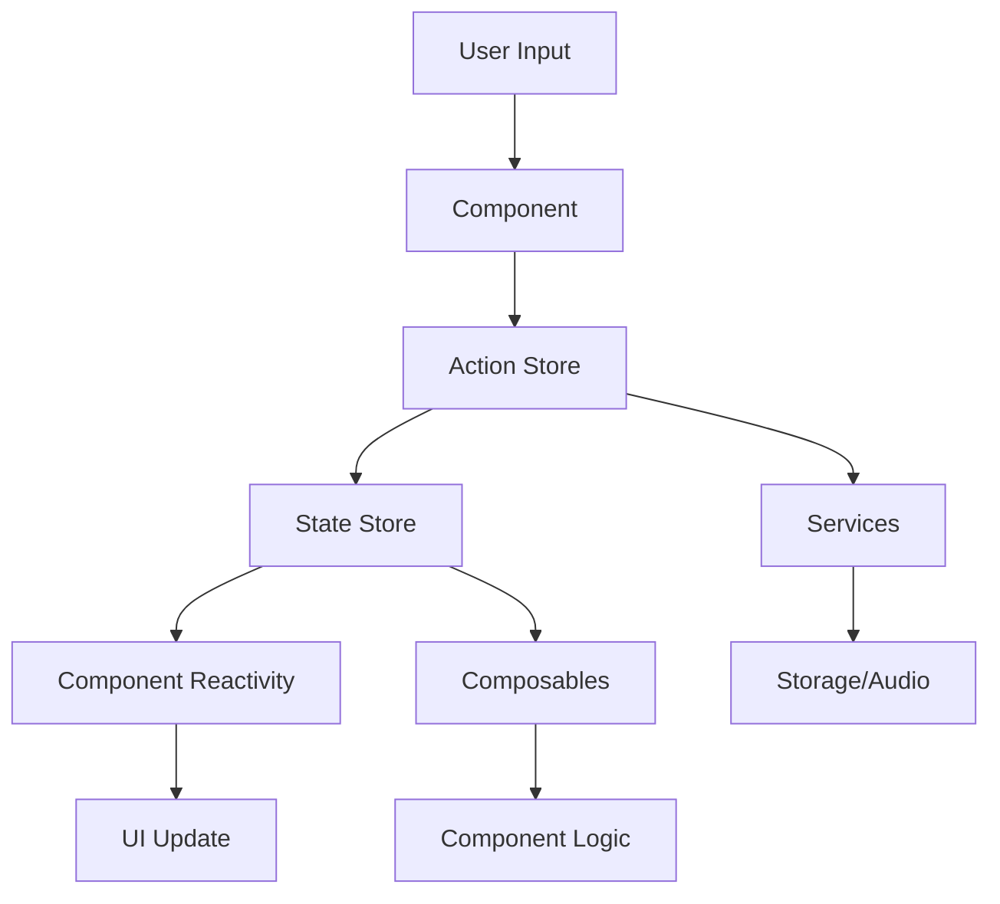

# Documentação Técnica - Mahjong Solitaire

## Índice
1. [Arquitetura do Sistema](#arquitetura-do-sistema)
2. [Algoritmos Principais](#algoritmos-principais)
3. [Sistema de Stores](#sistema-de-stores)
4. [Composables](#composables)
5. [Sistema de Pontuação](#sistema-de-pontuação)
6. [Algoritmo de Shuffling](#algoritmo-de-shuffling)
7. [Performance e Otimizações](#performance-e-otimizações)
8. [Guia para Contribuidores](#guia-para-contribuidores)

## Arquitetura do Sistema

### Visão Geral
O Mahjong Solitaire é construído usando Vue 3, TypeScript, Pinia para gerenciamento de estado, e Vite como bundler.

```
mahjong/
├── src/
│   ├── components/          # Componentes Vue
│   │   ├── GameView.vue    # View principal do jogo
│   │   ├── TileField.vue   # Campo de tiles
│   │   └── TutorialOverlay.vue # Tutorial interativo
│   ├── stores/             # Stores Pinia
│   │   ├── gameState.store.ts    # Estado do jogo
│   │   ├── gameActions.store.ts  # Ações do jogo
│   │   ├── gameTimer.store.ts    # Timer do jogo
│   │   └── gamePreferences.store.ts # Preferências
│   ├── composables/        # Composables reutilizáveis
│   │   ├── useGameTimer.ts      # Lógica do timer
│   │   ├── useGameAudio.ts      # Controle de áudio
│   │   ├── useGameKeyboard.ts   # Atalhos de teclado
│   │   └── useGameShuffle.ts    # Lógica de embaralhamento
│   ├── services/           # Serviços
│   │   ├── audio.service.ts     # Serviço de áudio com pool
│   │   ├── storage.service.ts   # Persistência IndexedDB
│   │   └── cache.service.ts     # Cache otimizado
│   └── models/             # Modelos de dados
│       └── tile.model.ts   # Modelo de Tile
```

### Fluxo de Dados



## Algoritmos Principais

### Sistema de Coordenadas 3D
Os tiles são posicionados em um sistema de coordenadas 3D:
- **X**: Posição horizontal (0-15)
- **Y**: Posição vertical (0-8)
- **Z**: Camada/profundidade (0-7)

### Detecção de Tiles Livres
Um tile está livre quando:
1. Não tem tiles acima dele (z+1)
2. Tem pelo menos um lado (esquerdo ou direito) desbloqueado

```typescript
isFree(): boolean {
  if (!this.active) return false;
  
  // Verificar se há tiles acima
  if (this.tilesAbove.length > 0) {
    return false;
  }
  
  // Verificar lados
  const leftBlocked = this.tilesOnLeft.length > 0;
  const rightBlocked = this.tilesOnRight.length > 0;
  
  return !leftBlocked || !rightBlocked;
}
```

## Sistema de Stores

### GameState Store
Gerencia o estado central do jogo:
- Tiles ativos
- Pontuação
- Timer
- Estados do jogo (pausado, completo, etc.)

### GameActions Store
Implementa a lógica do jogo:
- Seleção de tiles
- Remoção de pares
- Undo/Redo
- Auto-shuffle com mutex

### GameTimer Store
Gerencia o timer com cleanup adequado:
```typescript
function cleanup() {
  if (timerInterval) {
    clearInterval(timerInterval);
    timerInterval = null;
  }
}
```

### GamePreferences Store
Persiste preferências do usuário:
- Som/Música
- Velocidade de animação
- Tema visual
- Auto-shuffle

## Composables

### useGameTimer
Encapsula lógica de timer reutilizável com cleanup automático.

### useGameAudio
Gerencia áudio com pool limitado para prevenir memory leaks:
```typescript
const maxPoolSize = 10;
// Reutiliza AudioElements ao invés de clonar infinitamente
```

### useGameKeyboard
Implementa sistema completo de atalhos:
- H: Dica
- Ctrl+Z: Desfazer
- P: Pausar
- N: Novo jogo
- Navegação por setas

### useGameShuffle
Algoritmo otimizado de embaralhamento com garantia de solução.

## Sistema de Pontuação

### Cálculo Base
```typescript
const baseScore = 10;
const timeBonus = Math.max(0, 10 - Math.floor(timer / 30));
const comboBonus = currentCombo > 1 ? (currentCombo - 1) * 5 : 0;
const totalScore = baseScore + timeBonus + comboBonus;
```

### Fatores de Pontuação
- **Pontos Base**: 10 pontos por par
- **Bônus de Tempo**: Até 10 pontos extras para jogadas rápidas
- **Bônus de Combo**: 5 pontos extras por combo consecutivo

## Algoritmo de Shuffling

### Estratégia Principal
1. **Agrupamento**: Agrupa tiles por tipo compatível
2. **Distribuição**: Garante distribuição uniforme
3. **Validação**: Verifica se há solução possível
4. **Fallback**: Força pares se necessário

### Garantia de Solução
```typescript
// Sempre garante pelo menos um par jogável
function ensurePlayablePair(tiles: MjTile[]): void {
  const freeTiles = tiles.filter(t => t.isFree());
  if (freeTiles.length >= 2) {
    // Força dois tiles livres a serem do mesmo tipo
    freeTiles[0].type = freeTiles[1].type;
  }
}
```

## Performance e Otimizações

### Renderização Otimizada
- **v-memo**: Previne re-renders desnecessários
- **shallowRef**: Para arrays grandes de tiles
- **Lazy Loading**: Views não essenciais carregadas sob demanda

### Bundle Optimization
- **Code Splitting**: Separação em chunks lógicos
- **Tree Shaking**: Remoção de código não utilizado
- **Compressão**: Gzip e Brotli
- **PWA**: Suporte offline com service worker

### Métricas de Performance
- **Bundle Size**: <500KB (compressed)
- **FCP**: <1.5s
- **TTI**: <3s
- **FPS**: 60fps constante

## Guia para Contribuidores

### Setup do Ambiente
```bash
# Clonar repositório
git clone https://github.com/yourusername/mahjong.git

# Instalar dependências
npm install

# Rodar em desenvolvimento
npm run dev

# Rodar testes
npm run test

# Build para produção
npm run build -- --config vite.config.optimized.ts
```

### Padrões de Código
- **TypeScript**: Tipos stritos, sem `any`
- **Composables**: Para lógica reutilizável
- **Stores Modulares**: Separação de responsabilidades
- **Testes**: Unit, integration e E2E

### Fluxo de Contribuição
1. Fork o repositório
2. Crie branch feature: `git checkout -b feature/nova-feature`
3. Commit mudanças: `git commit -m 'feat: adiciona nova feature'`
4. Push: `git push origin feature/nova-feature`
5. Abra Pull Request

### Convenções de Commit
- `feat:` Nova funcionalidade
- `fix:` Correção de bug
- `docs:` Documentação
- `style:` Formatação
- `refactor:` Refatoração
- `test:` Testes
- `chore:` Tarefas gerais

### Checklist para PRs
- [ ] Código segue padrões do projeto
- [ ] Testes passando
- [ ] Documentação atualizada
- [ ] Sem console.logs
- [ ] Performance verificada
- [ ] Acessibilidade testada

## Recursos Adicionais

### Links Úteis
- [Vue 3 Documentation](https://vuejs.org/)
- [Pinia Documentation](https://pinia.vuejs.org/)
- [TypeScript Documentation](https://www.typescriptlang.org/)
- [Vite Documentation](https://vitejs.dev/)

### Ferramentas Recomendadas
- VSCode com extensões Vue/TypeScript
- Vue DevTools
- Lighthouse para performance
- axe DevTools para acessibilidade

---

Para dúvidas ou sugestões, abra uma issue no GitHub.