# Arquitetura do Sistema de Ofensiva Diária (Daily Streak)

## 🏗️ Visão Geral da Arquitetura

### Diagrama de Componentes

```mermaid
graph TB
    subgraph "Componentes Vue"
        UserProfileHeader[UserProfileHeader.vue]
        DailyStreakIndicator[DailyStreakIndicator.vue]
        TokenDisplay[TokenDisplay.vue]
        UserMenu[UserMenu.vue]
        ChallengeModal[ChallengeModal.vue]
    end
    
    subgraph "Stores Pinia"
        UserProfileStore[userProfile.store.ts]
        DailyStreakStore[dailyStreak.store.ts]
        ChallengesStore[challenges.store.ts]
    end
    
    subgraph "Composables"
        useDailyStreak[useDailyStreak()]
        useTokenSystem[useTokenSystem()]
        useUserLevel[useUserLevel()]
        useChallengeRules[useChallengeRules()]
    end
    
    subgraph "Services"
        StorageService[StorageService]
        DateService[DateService]
        RulesEngine[RulesEngine]
    end
    
    subgraph "Sistema de Regras"
        IChallengeRule[IChallengeRule]
        RuleFactory[RuleFactory]
        RulePlugins[Rule Plugins]
    end
    
    UserProfileHeader --> DailyStreakIndicator
    UserProfileHeader --> TokenDisplay
    UserProfileHeader --> UserMenu
    
    DailyStreakIndicator --> useDailyStreak
    TokenDisplay --> useTokenSystem
    UserMenu --> useUserLevel
    
    useDailyStreak --> DailyStreakStore
    useTokenSystem --> UserProfileStore
    useUserLevel --> UserProfileStore
    
    DailyStreakStore --> StorageService
    DailyStreakStore --> DateService
    DailyStreakStore --> RulesEngine
    
    ChallengesStore --> RulesEngine
    RulesEngine --> RuleFactory
    RuleFactory --> RulePlugins
```

### Fluxo de Dados

```mermaid
sequenceDiagram
    participant User
    participant Vue as Vue Components
    participant Store as Pinia Stores
    participant Service as Services
    participant Storage as LocalStorage
    
    User->>Vue: Acessa o jogo
    Vue->>Store: Carrega dados do usuário
    Store->>Storage: Recupera dados salvos
    Storage-->>Store: Dados do usuário
    Store-->>Vue: Estado atualizado
    Vue-->>User: UI renderizada
    
    User->>Vue: Completa partida
    Vue->>Store: Atualiza ofensiva
    Store->>Service: Valida regras
    Service-->>Store: Tokens e XP calculados
    Store->>Storage: Salva progresso
    Store-->>Vue: Estado atualizado
    Vue-->>User: Animação de recompensa
```



## 📦 Estrutura de Componentes

### 1. UserProfileHeader.vue

```vue
<template>
  <div class="user-profile-header" :class="{ 'mobile': isMobile }">
    <!-- Desktop Layout -->
    <div v-if="!isMobile" class="desktop-layout">
      <div class="profile-section">
        
        <div class="user-info">
          <span class="username">{{ username }}</span>
          <span class="level">Nível {{ userLevel }}</span>
        </div>
      </div>
      
      <DailyStreakIndicator />
      
      <div class="stats-section">
        <TokenDisplay />
        <div class="xp-bar">
          <div class="xp-fill" :style="{ width: xpProgress + '%' }"></div>
          <span class="xp-text">{{ currentXP }} / {{ nextLevelXP }} XP</span>
        </div>
      </div>
    </div>
    
    <!-- Mobile Layout -->
    <div v-else class="mobile-layout">
      <div class="mobile-row">
        
        <DailyStreakIndicator :compact="true" />
        <TokenDisplay :compact="true" />
      </div>
    </div>
    
    <UserMenu v-if="showUserMenu" @close="showUserMenu = false" />
  </div>
</template>

<script setup lang="ts">
import { ref, computed } from 'vue';
import { useUserProfileStore } from '@/stores/userProfile.store';
import { useResponsive } from '@/composables/useResponsive';
import DailyStreakIndicator from './DailyStreakIndicator.vue';
import TokenDisplay from './TokenDisplay.vue';
import UserMenu from './UserMenu.vue';

const userProfileStore = useUserProfileStore();
const { isMobile } = useResponsive();

const showUserMenu = ref(false);

const username = computed(() => userProfileStore.username);
const userAvatar = computed(() => userProfileStore.avatar || '/default-avatar.png');
const userLevel = computed(() => userProfileStore.level);
const currentXP = computed(() => userProfileStore.currentXP);
const nextLevelXP = computed(() => userProfileStore.getNextLevelXP());
const xpProgress = computed(() => (currentXP.value / nextLevelXP.value) * 100);

function openUserMenu() {
  showUserMenu.value = true;
}
</script>
```

### 2. DailyStreakIndicator.vue

```vue
<template>
  <div class="daily-streak-indicator" :class="{ 'compact': compact }">
    <div class="streak-flame" :class="flameClass" @click="showDetails">
      <i class="fa fa-fire"></i>
      <span class="streak-count">{{ currentStreak }}</span>
    </div>
    
    <transition name="fade">
      <div v-if="showTooltip && !compact" class="streak-tooltip">
        <h4>Ofensiva Diária</h4>
        <p>{{ currentStreak }} dias consecutivos!</p>
        <p v-if="hoursUntilReset">Próximo reset em {{ hoursUntilReset }}h</p>
        <div class="challenge-info" v-if="todayChallenge">
          <h5>Desafio de Hoje:</h5>
          <p>{{ todayChallenge.description }}</p>
          <p class="reward">Recompensa: {{ todayChallenge.reward }} tokens</p>
        </div>
      </div>
    </transition>
  </div>
</template>

<script setup lang="ts">
import { ref, computed } from 'vue';
import { useDailyStreak } from '@/composables/useDailyStreak';

const props = defineProps<{
  compact?: boolean;
}>();

const { 
  currentStreak, 
  isStreakActive, 
  hoursUntilReset,
  todayChallenge 
} = useDailyStreak();

const showTooltip = ref(false);

const flameClass = computed(() => ({
  'flame-active': isStreakActive.value,
  'flame-hot': currentStreak.value >= 7,
  'flame-blazing': currentStreak.value >= 30,
  'flame-legendary': currentStreak.value >= 100
}));

function showDetails() {
  if (!props.compact) {
    showTooltip.value = !showTooltip.value;
  }
}
</script>
```

### 3. TokenDisplay.vue

```vue
<template>
  <div class="token-display" :class="{ 'compact': compact }">
    <div class="token-icon">
      <i class="fa fa-coins"></i>
    </div>
    <transition 
      mode="out-in"
      @enter="animateValue"
    >
      <span :key="tokens" class="token-count">{{ formattedTokens }}</span>
    </transition>
  </div>
</template>

<script setup lang="ts">
import { computed } from 'vue';
import { useTokenSystem } from '@/composables/useTokenSystem';

const props = defineProps<{
  compact?: boolean;
}>();

const { tokens, formattedTokens } = useTokenSystem();

function animateValue(el: HTMLElement) {
  el.classList.add('token-animate');
  setTimeout(() => {
    el.classList.remove('token-animate');
  }, 600);
}
</script>
```

## 🗄️ Stores Pinia

### 1. userProfile.store.ts

```typescript
import { defineStore } from 'pinia';
import { ref, computed } from 'vue';
import { storageService } from '@/services/storage.service';

export interface UserProfile {
  id: string;
  username: string;
  avatar?: string;
  level: number;
  currentXP: number;
  totalXP: number;
  tokens: number;
  achievements: string[];
  preferences: UserPreferences;
  createdAt: Date;
  lastActiveAt: Date;
}

export interface UserPreferences {
  theme: 'light' | 'dark' | 'auto';
  soundEnabled: boolean;
  musicEnabled: boolean;
  notifications: boolean;
  language: string;
}

export const useUserProfileStore = defineStore('userProfile', () => {
  const profile = ref<UserProfile | null>(null);
  
  // Computed properties
  const username = computed(() => profile.value?.username || 'Jogador');
  const avatar = computed(() => profile.value?.avatar);
  const level = computed(() => profile.value?.level || 1);
  const currentXP = computed(() => profile.value?.currentXP || 0);
  const totalXP = computed(() => profile.value?.totalXP || 0);
  const tokens = computed(() => profile.value?.tokens || 0);
  
  // Level calculation
  function getNextLevelXP(): number {
    return level.value * 100 + (level.value - 1) * 50;
  }
  
  function getXPForLevel(targetLevel: number): number {
    let xp = 0;
    for (let i = 1; i < targetLevel; i++) {
      xp += i * 100 + (i - 1) * 50;
    }
    return xp;
  }
  
  // Token management
  function addTokens(amount: number, reason: string) {
    if (!profile.value) return;
    
    profile.value.tokens += amount;
    saveProfile();
    
    // Emit event for animations
    window.dispatchEvent(new CustomEvent('tokens-earned', {
      detail: { amount, reason }
    }));
  }
  
  function spendTokens(amount: number): boolean {
    if (!profile.value || profile.value.tokens < amount) {
      return false;
    }
    
    profile.value.tokens -= amount;
    saveProfile();
    return true;
  }
  
  // XP management
  function addXP(amount: number, source: string) {
    if (!profile.value) return;
    
    profile.value.currentXP += amount;
    profile.value.totalXP += amount;
    
    // Check for level up
    const requiredXP = getNextLevelXP();
    while (profile.value.currentXP >= requiredXP) {
      profile.value.currentXP -= requiredXP;
      profile.value.level++;
      
      // Level up rewards
      const levelUpTokens = profile.value.level * 10;
      addTokens(levelUpTokens, `Nível ${profile.value.level} alcançado!`);
      
      window.dispatchEvent(new CustomEvent('level-up', {
        detail: { newLevel: profile.value.level, tokens: levelUpTokens }
      }));
    }
    
    saveProfile();
  }
  
  // Achievement management
  function unlockAchievement(achievementId: string) {
    if (!profile.value || profile.value.achievements.includes(achievementId)) {
      return;
    }
    
    profile.value.achievements.push(achievementId);
    saveProfile();
    
    window.dispatchEvent(new CustomEvent('achievement-unlocked', {
      detail: { achievementId }
    }));
  }
  
  // Profile management
  async function loadProfile() {
    try {
      const savedProfile = await storageService.get<UserProfile>('userProfile');
      if (savedProfile) {
        profile.value = {
          ...savedProfile,
          createdAt: new Date(savedProfile.createdAt),
          lastActiveAt: new Date(savedProfile.lastActiveAt)
        };
      } else {
        // Create default profile
        profile.value = createDefaultProfile();
        await saveProfile();
      }
    } catch (error) {
      console.error('Failed to load profile:', error);
      profile.value = createDefaultProfile();
    }
  }
  
  async function saveProfile() {
    if (!profile.value) return;
    
    profile.value.lastActiveAt = new Date();
    
    try {
      await storageService.save('userProfile', profile.value);
    } catch (error) {
      console.error('Failed to save profile:', error);
    }
  }
  
  function createDefaultProfile(): UserProfile {
    return {
      id: crypto.randomUUID(),
      username: 'Jogador',
      level: 1,
      currentXP: 0,
      totalXP: 0,
      tokens: 100, // Starting tokens
      achievements: [],
      preferences: {
        theme: 'auto',
        soundEnabled: true,
        musicEnabled: true,
        notifications: true,
        language: 'pt-BR'
      },
      createdAt: new Date(),
      lastActiveAt: new Date()
    };
  }
  
  // Initialize on store creation
  loadProfile();
  
  return {
    // State
    profile,
    
    // Computed
    username,
    avatar,
    level,
    currentXP,
    totalXP,
    tokens,
    
    // Actions
    getNextLevelXP,
    getXPForLevel,
    addTokens,
    spendTokens,
    addXP,
    unlockAchievement,
    loadProfile,
    saveProfile
  };
});
```

### 2. dailyStreak.store.ts

```typescript
import { defineStore } from 'pinia';
import { ref, computed } from 'vue';
import { storageService } from '@/services/storage.service';
import { dateService } from '@/services/date.service';
import { useUserProfileStore } from './userProfile.store';
import { useChallengesStore } from './challenges.store';

export interface StreakData {
  currentStreak: number;
  longestStreak: number;
  lastPlayDate: Date | null;
  todayPlayed: boolean;
  weeklyProgress: boolean[];
  monthlyCalendar: Map<string, boolean>;
  totalDaysPlayed: number;
}

export const useDailyStreakStore = defineStore('dailyStreak', () => {
  const userProfileStore = useUserProfileStore();
  const challengesStore = useChallengesStore();
  
  const streakData = ref<StreakData>({
    currentStreak: 0,
    longestStreak: 0,
    lastPlayDate: null,
    todayPlayed: false,
    weeklyProgress: new Array(7).fill(false),
    monthlyCalendar: new Map(),
    totalDaysPlayed: 0
  });
  
  // Computed properties
  const currentStreak = computed(() => streakData.value.currentStreak);
  const longestStreak = computed(() => streakData.value.longestStreak);
  const todayPlayed = computed(() => streakData.value.todayPlayed);
  const isStreakActive = computed(() => {
    if (!streakData.value.lastPlayDate) return false;
    return dateService.isConsecutiveDay(streakData.value.lastPlayDate, new Date());
  });
  
  const hoursUntilReset = computed(() => {
    const now = new Date();
    const tomorrow = new Date(now);
    tomorrow.setDate(tomorrow.getDate() + 1);
    tomorrow.setHours(0, 0, 0, 0);
    return Math.ceil((tomorrow.getTime() - now.getTime()) / (1000 * 60 * 60));
  });
  
  // Streak management
  async function checkDailyLogin() {
    const today = dateService.getToday();
    const lastPlay = streakData.value.lastPlayDate;
    
    if (lastPlay && dateService.isSameDay(lastPlay, today)) {
      // Already played today
      return;
    }
    
    if (!lastPlay || dateService.isConsecutiveDay(lastPlay, today)) {
      // Continue streak
      streakData.value.currentStreak++;
      streakData.value.todayPlayed = true;
    } else {
      // Streak broken
      streakData.value.currentStreak = 1;
      streakData.value.todayPlayed = true;
      
      // Notify user of broken streak
      window.dispatchEvent(new CustomEvent('streak-broken', {
        detail: { previousStreak: streakData.value.currentStreak }
      }));
    }
    
    // Update longest streak
    if (streakData.value.currentStreak > streakData.value.longestStreak) {
      streakData.value.longestStreak = streakData.value.currentStreak;
    }
    
    // Update calendar
    streakData.value.lastPlayDate = today;
    streakData.value.monthlyCalendar.set(dateService.getDateKey(today), true);
    streakData.value.totalDaysPlayed++;
    
    // Update weekly progress
    const dayOfWeek = today.getDay();
    streakData.value.weeklyProgress[dayOfWeek] = true;
    
    // Award daily login bonus
    await awardDailyBonus();
    
    // Check for streak milestones
    await checkStreakMilestones();
    
    await saveStreakData();
  }
  
  async function completeGame(score: number, timeInSeconds: number) {
    // Ensure daily login is recorded
    await checkDailyLogin();
    
    // Check and complete daily challenge
    const challenge = await challengesStore.getTodayChallenge();
    if (challenge && !challenge.completed) {
      const completed = await challengesStore.checkChallengeCompletion(challenge, {
        score,
        timeInSeconds,
        movesCount: 0 // This would come from game store
      });
      
      if (completed) {
        userProfileStore.addTokens(challenge.reward, `Desafio diário: ${challenge.name}`);
        userProfileStore.addXP(challenge.xpReward || 50, 'Daily Challenge');
      }
    }
    
    // Base rewards for completing a game
    const baseTokens = 10;
    const baseXP = 25;
    
    // Streak multiplier
    const streakMultiplier = Math.min(1 + (currentStreak.value * 0.1), 3); // Max 3x
    
    const earnedTokens = Math.floor(baseTokens * streakMultiplier);
    const earnedXP = Math.floor(baseXP * streakMultiplier);
    
    userProfileStore.addTokens(earnedTokens, 'Partida completa');
    userProfileStore.addXP(earnedXP, 'Game Completion');
  }
  
  async function awardDailyBonus() {
    const bonusTokens = 50 + (currentStreak.value * 5); // More tokens for longer streaks
    userProfileStore.addTokens(bonusTokens, `Login diário (${currentStreak.value} dias)`);
    userProfileStore.addXP(25, 'Daily Login');
  }
  
  async function checkStreakMilestones() {
    const milestones = [3, 7, 14, 30, 60, 100, 365];
    
    for (const milestone of milestones) {
      if (currentStreak.value === milestone) {
        const achievementId = `streak_${milestone}_days`;
        userProfileStore.unlockAchievement(achievementId);
        
        // Bonus rewards for milestones
        const bonusTokens = milestone * 10;
        userProfileStore.addTokens(bonusTokens, `Marco de ${milestone} dias!`);
        userProfileStore.addXP(milestone * 5, `${milestone} Day Streak`);
        
        break;
      }
    }
  }
  
  // Persistence
  async function loadStreakData() {
    try {
      const saved = await storageService.get<any>('dailyStreak');
      if (saved) {
        streakData.value = {
          ...saved,
          lastPlayDate: saved.lastPlayDate ? new Date(saved.lastPlayDate) : null,
          monthlyCalendar: new Map(saved.monthlyCalendar || [])
        };
        
        // Check if streak is still valid
        if (streakData.value.lastPlayDate) {
          const today = dateService.getToday();
          if (!dateService.isConsecutiveDay(streakData.value.lastPlayDate, today) &&
              !dateService.isSameDay(streakData.value.lastPlayDate, today)) {
            // Streak broken
            streakData.value.currentStreak = 0;
            streakData.value.todayPlayed = false;
          }
        }
      }
    } catch (error) {
      console.error('Failed to load streak data:', error);
    }
  }
  
  async function saveStreakData() {
    try {
      const dataToSave = {
        ...streakData.value,
        monthlyCalendar: Array.from(streakData.value.monthlyCalendar.entries())
      };
      await storageService.save('dailyStreak', dataToSave);
    } catch (error) {
      console.error('Failed to save streak data:', error);
    }
  }
  
  // Initialize
  loadStreakData();
  
  return {
    // State
    streakData,
    
    // Computed
    currentStreak,
    longestStreak,
    todayPlayed,
    isStreakActive,
    hoursUntilReset,
    
    // Actions
    checkDailyLogin,
    completeGame,
    loadStreakData,
    saveStreakData
  };
});
```

### 3. challenges.store.ts

```typescript
import { defineStore } from 'pinia';
import { ref, computed } from 'vue';
import { storageService } from '@/services/storage.service';
import { RulesEngine } from '@/services/rules.engine';
import type { IChallengeRule, ChallengeContext } from '@/types/challenges.types';

export interface Challenge {
  id: string;
  name: string;
  description: string;
  type: 'daily' | 'weekly' | 'special';
  rules: IChallengeRule[];
  reward: number;
  xpReward?: number;
  startDate: Date;
  endDate: Date;
  completed: boolean;
  progress?: number;
  maxProgress?: number;
}

export const useChallengesStore = defineStore('challenges', () => {
  const rulesEngine = new RulesEngine();
  const challenges = ref<Challenge[]>([]);
  const todayChallenge = ref<Challenge | null>(null);
  
  // Computed
  const activeChallenges = computed(() => 
    challenges.value.filter(c => !c.completed && new Date() <= c.endDate)
  );
  
  const completedChallenges = computed(() => 
    challenges.value.filter(c => c.completed)
  );
  
  // Challenge management
  async function loadChallenges() {
    try {
      const saved = await storageService.get<Challenge[]>('challenges') || [];
      challenges.value = saved.map(c => ({
        ...c,
        startDate: new Date(c.startDate),
        endDate: new Date(c.endDate)
      }));
      
      // Generate today's challenge if needed
      await ensureTodayChallenge();
    } catch (error) {
      console.error('Failed to load challenges:', error);
    }
  }
  
  async function ensureTodayChallenge() {
    const today = new Date();
    today.setHours(0, 0, 0, 0);
    
    const existingToday = challenges.value.find(c => 
      c.type === 'daily' && 
      c.startDate.getTime() === today.getTime()
    );
    
    if (!existingToday) {
      // Generate new daily challenge
      const newChallenge = await generateDailyChallenge();
      challenges.value.push(newChallenge);
      await saveChallenges();
    }
    
    todayChallenge.value = existingToday || challenges.value[challenges.value.length - 1];
  }
  
  async function generateDailyChallenge(): Promise<Challenge> {
    const today = new Date();
    today.setHours(0, 0, 0, 0);
    
    const tomorrow = new Date(today);
    tomorrow.setDate(tomorrow.getDate() + 1);
    
    // Rotate through different challenge types
    const dayOfWeek = today.getDay();
    const challengeTemplates = [
      {
        name: 'Velocista',
        description: 'Complete uma partida em menos de 5 minutos',
        rules: [rulesEngine.createRule('time-limit', { maxTime: 300 })],
        reward: 100,
        xpReward: 50
      },
      {
        name: 'Perfeccionista',
        description: 'Complete uma partida sem usar dicas',
        rules: [rulesEngine.createRule('no-hints', {})],
        reward: 150,
        xpReward: 75
      },
      {
        name: 'Mestre dos Pontos',
        description: 'Alcance 500 pontos em uma partida',
        rules: [rulesEngine.createRule('minimum-score', { minScore: 500 })],
        reward: 120,
        xpReward: 60
      },
      {
        name: 'Sem Erros',
        description: 'Complete uma partida sem desfazer jogadas',
        rules: [rulesEngine.createRule('no-undo', {})],
        reward: 130,
        xpReward: 65
      },
      {
        name: 'Combo Master',
        description: 'Faça 5 combinações consecutivas',
        rules: [rulesEngine.createRule('combo-streak', { minCombo: 5 })],
        reward: 140,
        xpReward: 70
      },
      {
        name: 'Estrategista',
        description: 'Complete uma partida com menos de 50 movimentos',
        rules: [rulesEngine.createRule('move-limit', { maxMoves: 50 })],
        reward: 160,
        xpReward: 80
      },
      {
        name: 'Maratonista',
        description: 'Jogue 3 partidas hoje',
        rules: [rulesEngine.createRule('games-played', { minGames: 3 })],
        reward: 90,
        xpReward: 45
      }
    ];
    
    const template = challengeTemplates[dayOfWeek % challengeTemplates.length];
    
    return {
      id: `daily_${today.getTime()}`,
      ...template,
      type: 'daily',
      startDate: today,
      endDate: tomorrow,
      completed: false
    };
  }
  
  async function checkChallengeCompletion(
    challenge: Challenge, 
    context: ChallengeContext
  ): Promise<boolean> {
    if (challenge.completed) return false;
    
    const allRulesMet = challenge.rules.every(rule => 
      rulesEngine.evaluateRule(rule, context)
    );
    
    if (allRulesMet) {
      challenge.completed = true;
      await saveChallenges();
      
      window.dispatchEvent(new CustomEvent('challenge-completed', {
        detail: { challenge }
      }));
      
      return true;
    }
    
    return false;
  }
  
  async function getTodayChallenge(): Promise<Challenge | null> {
    await ensureTodayChallenge();
    return todayChallenge.value;
  }
  
  // Persistence
  async function saveChallenges() {
    try {
      await storageService.save('challenges', challenges.value);
    } catch (error) {
      console.error('Failed to save challenges:', error);
    }
  }
  
  // Initialize
  loadChallenges();
  
  return {
    // State
    challenges,
    todayChallenge,
    
    // Computed
    activeChallenges,
    completedChallenges,
    
    // Actions
    loadChallenges,
    getTodayChallenge,
    checkChallengeCompletion,
    generateDailyChallenge
  };
});
```

## 🔧 Sistema de Regras Modulares

### Interface Base

```typescript
// types/challenges.types.ts
export interface IChallengeRule {
  type: string;
  evaluate(context: ChallengeContext): boolean;
  getDescription(): string;
}

export interface ChallengeContext {
  score: number;
  timeInSeconds: number;
  movesCount: number;
  hintsUsed: number;
  undoCount: number;
  comboStreak: number;
  gamesPlayedToday?: number;
  [key: string]: any;
}

export interface RuleConfig {
  [key: string]: any;
}
```

### Rules Engine

```typescript
// services/rules.engine.ts
import type { IChallengeRule, ChallengeContext, RuleConfig } from '@/types/challenges.types';

export class RulesEngine {
  private ruleFactories: Map<string, (config: RuleConfig) => IChallengeRule> = new Map();
  
  constructor() {
    this.registerDefaultRules();
  }
  
  registerRule(type: string, factory: (config: RuleConfig) => IChallengeRule) {
    this.ruleFactories.set(type, factory);
  }
  
  createRule(type: string, config: RuleConfig): IChallengeRule {
    const factory = this.ruleFactories.get(type);
    if (!factory) {
      throw new Error(`Unknown rule type: ${type}`);
    }
    return factory(config);
  }
  
  evaluateRule(rule: IChallengeRule, context: ChallengeContext): boolean {
    return rule.evaluate(context);
  }
  
  private registerDefaultRules() {
    // Time limit rule
    this.registerRule('time-limit', (config) => ({
      type: 'time-limit',
      evaluate: (context) => context.timeInSeconds <= config.maxTime,
      getDescription: () => `Complete em menos de ${config.maxTime / 60} minutos`
    }));
    
    // Minimum score rule
    this.registerRule('minimum-score', (config) => ({
      type: 'minimum-score',
      evaluate: (context) => context.score >= config.minScore,
      getDescription: () => `Alcance ${config.minScore} pontos`
    }));
    
    // No hints rule
    this.registerRule('no-hints', () => ({
      type: 'no-hints',
      evaluate: (context) => context.hintsUsed === 0,
      getDescription: () => 'Não use dicas'
    }));
    
    // No undo rule
    this.registerRule('no-undo', () => ({
      type: 'no-undo',
      evaluate: (context) => context.undoCount === 0,
      getDescription: () => 'Não desfaça jogadas'
    }));
    
    // Combo streak rule
    this.registerRule('combo-streak', (config) => ({
      type: 'combo-streak',
      evaluate: (context) => context.comboStreak >= config.minCombo,
      getDescription: () => `Faça ${config.minCombo} combinações consecutivas`
    }));
    
    // Move limit rule
    this.registerRule('move-limit', (config) => ({
      type: 'move-limit',
      evaluate: (context) => context.movesCount <= config.maxMoves,
      getDescription: () => `Complete com no máximo ${config.maxMoves} movimentos`
    }));
    
    // Games played rule
    this.registerRule('games-played', (config) => ({
      type: 'games-played',
      evaluate: (context) => (context.gamesPlayedToday || 0) >= config.minGames,
      getDescription: () => `Jogue ${config.minGames} partidas hoje`
    }));
  }
}
```

## 🎨 Estilos e Animações

### animations.scss

```scss
// Flame animation for streak indicator
@keyframes flame-flicker {
  0%, 100% {
    transform: scale(1) translateY(0);
    filter: brightness(1);
  }
  25% {
    transform: scale(1.1) translateY(-2px);
    filter: brightness(1.2);
  }
  50% {
    transform: scale(0.95) translateY(1px);
    filter: brightness(0.9);
  }
  75% {
    transform: scale(1.05) translateY(-1px);
    filter: brightness(1.1);
  }
}

@keyframes flame-glow {
  0%, 100% {
    text-shadow: 
      0 0 10px rgba(255, 140, 0, 0.8),
      0 0 20px rgba(255, 140, 0, 0.6),
      0 0 30px rgba(255, 140, 0, 0.4);
  }
  50% {
    text-shadow: 
      0 0 15px rgba(255, 140, 0, 1),
      0 0 25px rgba(255, 140, 0, 0.8),
      0 0 35px rgba(255, 140, 0, 0.6);
  }
}

// Token animation
@keyframes token-bounce {
  0%, 100% {
    transform: translateY(0) scale(1);
  }
  50% {
    transform: translateY(-10px) scale(1.2);
  }
}

.token-animate {
  animation: token-bounce 0.6s ease-out;
}

// Level up animation
@keyframes level-up-burst {
  0% {
    transform: scale(0);
    opacity: 0;
  }
  50% {
    transform: scale(1.5);
    opacity: 1;
  }
  100% {
    transform: scale(1);
    opacity: 0;
  }
}

// Streak milestone animation
@keyframes milestone-celebration {
  0% {
    transform: rotate(0deg) scale(1);
  }
  25% {
    transform: rotate(-5deg) scale(1.1);
  }
  50% {
    transform: rotate(5deg) scale(1.2);
  }
  75% {
    transform: rotate(-3deg) scale(1.1);
  }
  100% {
    transform: rotate(0deg) scale(1);
  }
}
```

## 📱 Integração Mobile

### Responsividade

```scss
// Mobile breakpoints
$mobile: 576px;
$tablet: 768px;
$desktop: 1024px;

.user-profile-header {
  .desktop-layout {
    display: flex;
    align-items: center;
    justify-content: space-between;
    padding: 12px 20px;
    background: rgba(0, 0, 0, 0.9);
    
    @media (max-width: $tablet) {
      display: none;
    }
  }
  
  .mobile-layout {
    display: none;
    
    @media (max-width: $tablet) {
      display: block;
      background: rgba(0, 0, 0, 0.95);
      padding: 8px 12px;
    }
    
    .mobile-row {
      display: flex;
      align-items: center;
      justify-content: space-between;
      gap: 10px;
    }
  }
}

// Compact components for mobile
.daily-streak-indicator.compact {
  .streak-flame {
    font-size: 1.2rem;
    padding: 4px 8px;
  }
  
  .streak-tooltip {
    display: none;
  }
}

.token-display.compact {
  font-size: 0.9rem;
  
  .token-icon {
    width: 20px;
    height: 20px;
  }
}
```

## 🔄 Sincronização Futura

### API Contracts (para futura implementação)

```typescript
// api/contracts/user.contract.ts
export interface UserSyncData {
  profile: UserProfile;
  streak: StreakData;
  challenges: Challenge[];
  lastSync: Date;
}

export interface SyncResponse {
  success: boolean;
  data?: UserSyncData;
  conflicts?: SyncConflict[];
}

export interface SyncConflict {
  field: string;
  localValue: any;
  serverValue: any;
  resolution: 'local' | 'server' | 'merge';
}

// Future API endpoints
export const API_ENDPOINTS = {
  syncProfile: '/api/user/sync',
  getLeaderboard: '/api/leaderboard',
  getChallenges: '/api/challenges',
  reportProgress: '/api/progress'
};
```

## 🚀 Próximos Passos

1. **Implementar componentes base**
2. **Criar sistema de animações**
3. **Adicionar testes unitários**
4. **Implementar sistema de notificações**
5. **Criar tutoriais interativos**
6. **Adicionar mais tipos de desafios**
7. **Implementar sistema de conquistas**
8. **Preparar para sincronização backend**