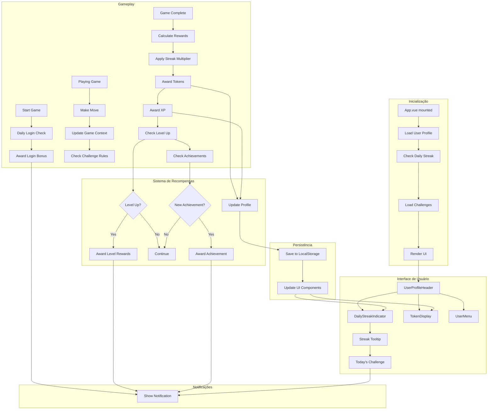
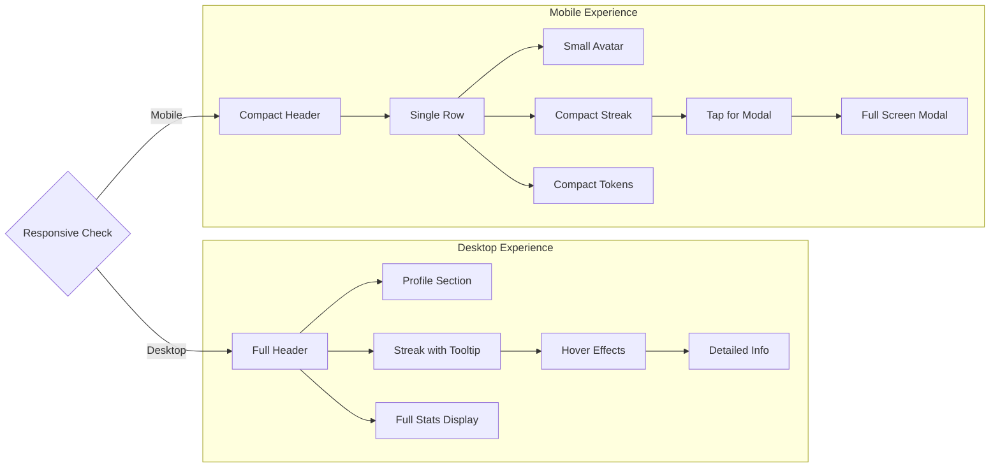
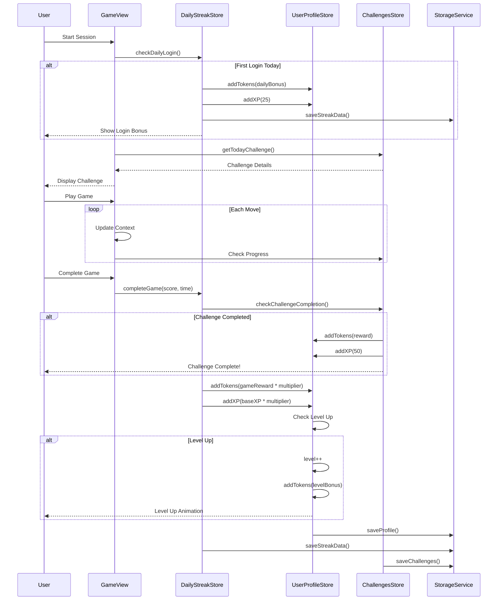
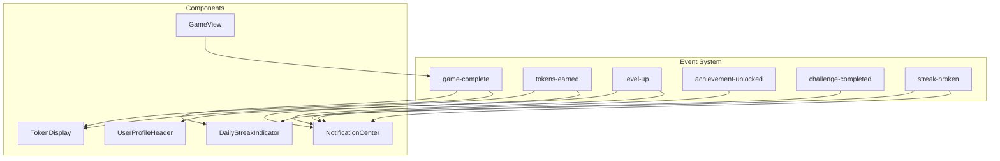
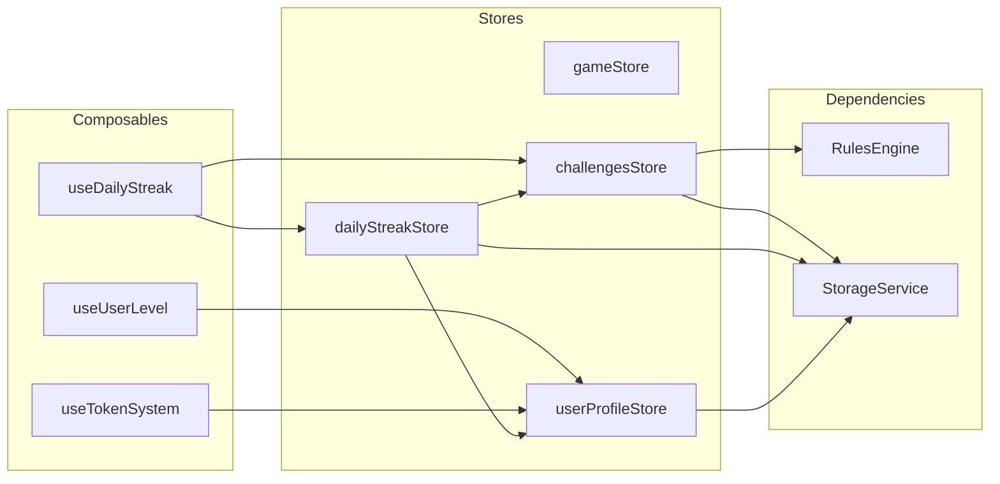

# Fluxo de Integração - Sistema de Ofensiva Diária

## 🔄 Fluxo Completo de Interação



## 📱 Mobile vs Desktop Flow



## 🎮 Game Session Lifecycle



## 🔌 Component Communication



## 🏗️ Store Dependencies



## 📊 Data Flow Examples

### 1. Daily Login Flow
```typescript
// User opens app
App.mounted() {
  await userProfileStore.loadProfile();
  await dailyStreakStore.checkDailyLogin();
  // If new day:
  // - Increment streak
  // - Award login bonus
  // - Generate daily challenge
  // - Show notifications
}
```

### 2. Game Completion Flow
```typescript
// Game ends
gameStore.isGameComplete = true;

// Emit event
window.dispatchEvent(new CustomEvent('game-complete', {
  detail: { score: 450, time: 240 }
}));

// useDailyStreak composable handles it
async handleGameComplete(event) {
  const { score, time } = event.detail;
  
  // 1. Complete daily streak
  await streakStore.completeGame(score, time);
  
  // 2. Check challenges
  const challenge = await challengesStore.getTodayChallenge();
  if (challenge && rulesEngine.evaluate(challenge.rules, context)) {
    // Award challenge rewards
  }
  
  // 3. Calculate total rewards
  const tokens = baseTokens * streakMultiplier;
  const xp = baseXP * streakMultiplier;
  
  // 4. Update profile
  userProfileStore.addTokens(tokens, 'Game Complete');
  userProfileStore.addXP(xp, 'Game Complete');
}
```

### 3. Challenge Validation Flow
```typescript
// During gameplay
gameStore.on('move', (move) => {
  // Update context
  gameContextService.recordMove(move.tile1, move.tile2);
  
  // Get current context
  const context = gameContextService.getCurrentContext();
  
  // Check active challenges
  const activeChallenges = challengesStore.activeChallenges;
  
  activeChallenges.forEach(challenge => {
    const progress = rulesEngine.evaluateProgress(challenge.rules, context);
    
    // Update UI with progress
    if (progress.changed) {
      updateChallengeProgress(challenge.id, progress);
    }
  });
});
```

## 🎨 UI State Management

### Component State Hierarchy
```
App.vue
├── UserProfileHeader.vue
│   ├── state: { showMenu: false }
│   ├── DailyStreakIndicator.vue
│   │   └── state: { showTooltip: false }
│   ├── TokenDisplay.vue
│   │   └── state: { animating: false }
│   └── UserMenu.vue
│       └── state: { activeTab: 'profile' }
├── GameView.vue
│   ├── computed: from gameStore
│   └── ChallengeModal.vue
│       └── props: { challenge }
└── NotificationCenter.vue
    └── state: { notifications: [] }
```

### Reactive Data Flow
```typescript
// Profile changes trigger UI updates
userProfileStore.$subscribe((mutation, state) => {
  // TokenDisplay auto-updates via computed
  // Level changes trigger animations
  // Achievement unlocks show notifications
});

// Streak changes update indicator
dailyStreakStore.$subscribe((mutation, state) => {
  // Flame animation changes
  // Multiplier updates
  // Milestone notifications
});
```

## 🔐 Security Considerations

1. **Client-side Validation**: All rewards are calculated client-side (for now)
2. **Future Server Sync**: Prepared for server validation
3. **Anti-cheat**: Basic timestamp validation
4. **Data Integrity**: Checksums for critical data

## 🚀 Performance Optimizations

1. **Lazy Loading**: Challenge rules loaded on demand
2. **Debounced Saves**: Storage writes are batched
3. **Computed Caching**: Heavy calculations are memoized
4. **Event Throttling**: Notifications are queued
5. **Component Splitting**: Mobile/Desktop components loaded conditionally

## 📱 Progressive Enhancement

```typescript
// Base functionality works without daily streak
if (featureFlags.dailyStreak) {
  // Enhanced experience with streak system
  loadDailyStreakModule();
} else {
  // Basic game experience
  loadBasicGame();
}
```