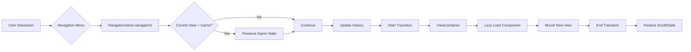

# Navigation System Architecture

## Overview

The navigation system provides a seamless, mobile-first experience for navigating between different views in the Mahjong application. It leverages existing implementations while introducing new components for enhanced user experience.

## Core Components

### 1. NavigationStore (Existing - Pinia)

The existing `navigation.store.ts` already implements comprehensive state management:

```typescript
interface NavigationState {
  currentView: ViewType;
  previousView: ViewType | null;
  navigationHistory: NavigationEntry[];
  isTransitioning: boolean;
  transitionDirection: TransitionDirection;
  gameStateSnapshot: GameStateSnapshot | null;
  shouldPreserveGameState: boolean;
  isBottomNavVisible: boolean;
  activeTabIndex: number;
}
```

**Key Features:**
- ✅ View state tracking (current, previous, history)
- ✅ Game state preservation when navigating away
- ✅ Transition direction detection (forward/backward)
- ✅ Bottom navigation visibility control
- ✅ History management with depth limiting
- ✅ Scroll position restoration

### 2. ViewContainer Component (New)

A new component to manage view transitions and lazy loading:

```vue
<!-- src/components/ViewContainer.vue -->
<template>
  <div class="view-container" :class="containerClasses">
    <Transition
      :name="transitionName"
      @before-enter="onBeforeEnter"
      @after-leave="onAfterLeave"
      mode="out-in"
    >
      <component
        :is="currentViewComponent"
        :key="navigationStore.currentView"
        v-bind="viewProps"
        class="view-content"
      />
    </Transition>
  </div>
</template>

<script setup lang="ts">
interface Props {
  preserveScroll?: boolean;
  transitionDuration?: number;
}

const props = withDefaults(defineProps<Props>(), {
  preserveScroll: true,
  transitionDuration: 300
});

// Dynamic component imports for lazy loading
const viewComponents = {
  home: () => import('@/views/HomeView.vue'),
  game: () => import('@/components/GameView.vue'),
  profile: () => import('@/views/ProfileView.vue'),
  settings: () => import('@/views/SettingsView.vue'),
  achievements: () => import('@/views/AchievementsView.vue'),
  store: () => import('@/views/StoreView.vue')
};
</script>
```

**Features:**
- Lazy loading of view components
- Smooth transitions with direction awareness
- Scroll position preservation
- Loading states for async components
- Error boundaries for failed loads

### 3. NavigationMenu Component (Existing - Enhanced)

The existing `NavigationMenu.vue` already provides:
- ✅ Mobile bottom navigation
- ✅ Desktop header navigation
- ✅ Active state indicators
- ✅ Badge support
- ✅ Gesture indicators for iOS

**Enhancements needed:**
- Integration with ViewContainer transitions
- Haptic feedback on mobile
- Preload hints for better performance

### 4. View Components

#### HomeView.vue
```vue
<template>
  <div class="home-view">
    <header class="home-header">
      <h1>Mahjong Solitaire</h1>
      <DailyStreakIndicator />
    </header>
    
    <section class="quick-actions">
      <button class="play-button" @click="startGame">
        <GameIcon />
        <span>Continuar Jogo</span>
      </button>
      
      <div class="stats-grid">
        <StatCard
          title="Melhor Pontuação"
          :value="userProfile.stats.highScore"
          icon="trophy"
        />
        <StatCard
          title="Jogos Completados"
          :value="userProfile.stats.gamesCompleted"
          icon="check"
        />
        <StatCard
          title="Sequência"
          :value="dailyStreak.currentStreak"
          :suffix="`dia${dailyStreak.currentStreak !== 1 ? 's' : ''}`"
          icon="fire"
        />
        <StatCard
          title="Nível"
          :value="userProfile.level"
          icon="star"
        />
      </div>
    </section>
    
    <section class="recent-achievements">
      <h2>Conquistas Recentes</h2>
      <AchievementList :limit="3" />
    </section>
  </div>
</template>
```

#### ProfileView.vue
```vue
<template>
  <div class="profile-view">
    <UserProfileHeader variant="full" />
    
    <section class="profile-stats">
      <h2>Estatísticas Detalhadas</h2>
      <GameStatistics />
    </section>
    
    <section class="profile-progress">
      <h2>Progresso</h2>
      <LevelProgress
        :current-xp="userProfile.xp"
        :level="userProfile.level"
        :next-level-xp="getNextLevelXP()"
      />
    </section>
    
    <section class="profile-history">
      <h2>Histórico de Jogos</h2>
      <GameHistory :limit="10" />
    </section>
  </div>
</template>
```

#### SettingsView.vue
```vue
<template>
  <div class="settings-view">
    <header class="settings-header">
      <h1>Configurações</h1>
    </header>
    
    <section class="settings-group">
      <h2>Aparência</h2>
      <SettingToggle
        v-model="gameStore.theme"
        label="Tema Escuro"
        :options="['light', 'dark']"
      />
      <SettingSlider
        v-model="gameStore.tileScale"
        label="Tamanho das Peças"
        :min="0.8"
        :max="1.2"
      />
    </section>
    
    <section class="settings-group">
      <h2>Som e Vibração</h2>
      <SettingToggle
        v-model="gameStore.soundEnabled"
        label="Efeitos Sonoros"
      />
      <SettingToggle
        v-model="gameStore.hapticEnabled"
        label="Vibração (Mobile)"
      />
    </section>
    
    <section class="settings-group">
      <h2>Gameplay</h2>
      <SettingSelect
        v-model="gameStore.animationSpeed"
        label="Velocidade das Animações"
        :options="['slow', 'normal', 'fast']"
      />
      <SettingToggle
        v-model="gameStore.showHints"
        label="Mostrar Dicas Visuais"
      />
    </section>
  </div>
</template>
```

#### AchievementsView.vue
```vue
<template>
  <div class="achievements-view">
    <header class="achievements-header">
      <h1>Conquistas</h1>
      <div class="progress-summary">
        {{ unlockedCount }} / {{ totalCount }} desbloqueadas
      </div>
    </header>
    
    <section class="achievement-categories">
      <CategoryTab
        v-for="category in categories"
        :key="category.id"
        :category="category"
        :active="activeCategory === category.id"
        @click="activeCategory = category.id"
      />
    </section>
    
    <section class="achievement-list">
      <TransitionGroup name="achievement-fade">
        <AchievementCard
          v-for="achievement in filteredAchievements"
          :key="achievement.id"
          :achievement="achievement"
          :unlocked="isUnlocked(achievement.id)"
        />
      </TransitionGroup>
    </section>
  </div>
</template>
```

#### StoreView.vue
```vue
<template>
  <div class="store-view">
    <header class="store-header">
      <h1>Loja</h1>
      <TokenBalance :balance="userProfile.tokens" />
    </header>
    
    <section class="store-categories">
      <button
        v-for="category in storeCategories"
        :key="category.id"
        :class="{ active: activeCategory === category.id }"
        @click="activeCategory = category.id"
      >
        {{ category.name }}
      </button>
    </section>
    
    <section class="store-items">
      <TransitionGroup name="item-fade">
        <StoreItem
          v-for="item in filteredItems"
          :key="item.id"
          :item="item"
          :purchased="isPurchased(item.id)"
          :can-afford="canAfford(item.price)"
          @purchase="purchaseItem"
        />
      </TransitionGroup>
    </section>
  </div>
</template>
```

## Integration Architecture

### App.vue Modifications

```vue
<template>
  <div id="app" :class="appClasses" :style="mobileStyles">
    <!-- Navigation Menu (Desktop Header / Mobile Bottom) -->
    <NavigationMenu 
      v-if="!isInGameFullscreen"
      :variant="isMobile ? 'mobile' : 'desktop'"
    />
    
    <!-- Main View Container -->
    <ViewContainer
      :preserve-scroll="true"
      :transition-duration="300"
      class="main-content"
    />
    
    <!-- Global Dialogs -->
    <DialogContainer />
    
    <!-- Loading Overlay -->
    <LoadingOverlay v-if="isLoading" />
  </div>
</template>

<script setup lang="ts">
// Enhanced app setup
const isInGameFullscreen = computed(() => 
  navigationStore.currentView === 'game' && 
  gameStore.isFullscreen
);

// Preload critical views
onMounted(() => {
  // Preload home and game views for instant navigation
  import('@/views/HomeView.vue');
  import('@/components/GameView.vue');
});
</script>
```

### Navigation Flow



## State Preservation Strategy

### Game State Preservation
```typescript
interface GameStateSnapshot {
  tiles: TileState[];
  score: number;
  timer: number;
  isPaused: boolean;
  selectedTileId: string | null;
  hints: number;
  timestamp: number;
  undoStack: GameAction[];
  redoStack: GameAction[];
}
```

### View State Preservation
```typescript
interface ViewStateSnapshot {
  scrollPosition: number;
  formData?: Record<string, any>;
  activeTab?: string;
  expandedSections?: string[];
}
```

## Performance Optimizations

### 1. Lazy Loading Strategy
- Initial bundle: App shell + Home + Game views
- On-demand loading: Profile, Settings, Achievements, Store
- Preload hints based on navigation patterns

### 2. Transition Performance
```scss
// Hardware-accelerated transitions
.view-transition-enter-active,
.view-transition-leave-active {
  transition: transform 0.3s ease, opacity 0.3s ease;
  will-change: transform, opacity;
}

// Direction-aware transitions
.view-transition-forward-enter-from {
  transform: translateX(100%);
}

.view-transition-backward-enter-from {
  transform: translateX(-100%);
}
```

### 3. Memory Management
- Automatic cleanup of old history entries (max 20)
- View component caching for recently visited views
- Efficient state snapshots with selective field preservation

## Mobile-Specific Features

### iOS Safe Areas
```scss
.navigation-menu.mobile {
  padding-bottom: env(safe-area-inset-bottom);
}

.view-container {
  padding-top: env(safe-area-inset-top);
  padding-bottom: calc(56px + env(safe-area-inset-bottom));
}
```

### Gesture Support
- Swipe-to-navigate on mobile devices
- Pull-to-refresh on scrollable views
- Edge swipe for back navigation

### Haptic Feedback
```typescript
function provideHapticFeedback(type: 'light' | 'medium' | 'heavy') {
  if ('vibrate' in navigator) {
    const patterns = {
      light: [10],
      medium: [20],
      heavy: [30, 10, 30]
    };
    navigator.vibrate(patterns[type]);
  }
}
```

## Accessibility

### ARIA Attributes
- `aria-current="page"` for active navigation items
- `aria-label` for icon-only buttons
- `role="navigation"` for menu containers
- Live regions for view change announcements

### Keyboard Navigation
- Tab navigation through menu items
- Enter/Space to activate
- Escape to close modals
- Arrow keys for menu navigation

## Testing Strategy

### Unit Tests
```typescript
describe('NavigationStore', () => {
  it('preserves game state when navigating away', async () => {
    // Setup game state
    gameStore.tiles = mockTiles;
    gameStore.score = 1000;
    
    // Navigate away from game
    await navigationStore.navigateTo('home');
    
    // Verify state was preserved
    expect(navigationStore.gameStateSnapshot).toBeDefined();
    expect(navigationStore.gameStateSnapshot.score).toBe(1000);
  });
});
```

### E2E Tests
```typescript
describe('Navigation Flow', () => {
  it('maintains game state across navigation', async () => {
    // Start game
    await page.click('[data-test="start-game"]');
    
    // Make some moves
    await page.click('[data-test="tile-1"]');
    await page.click('[data-test="tile-2"]');
    
    // Navigate to profile
    await page.click('[data-test="nav-profile"]');
    
    // Return to game
    await page.click('[data-test="nav-game"]');
    
    // Verify game state restored
    const score = await page.textContent('[data-test="score"]');
    expect(score).toBe('100');
  });
});
```

## Implementation Timeline

1. **Phase 1**: ViewContainer implementation
2. **Phase 2**: View components (Home, Profile, Settings)
3. **Phase 3**: Enhanced NavigationMenu integration
4. **Phase 4**: Achievements and Store views
5. **Phase 5**: Performance optimizations and testing

## Future Enhancements

- Route-based code splitting
- Predictive prefetching based on user patterns
- Offline navigation with service workers
- Deep linking support for sharing
- Animation customization preferences